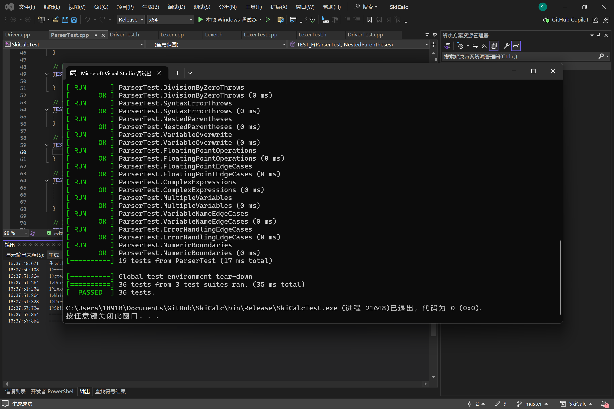
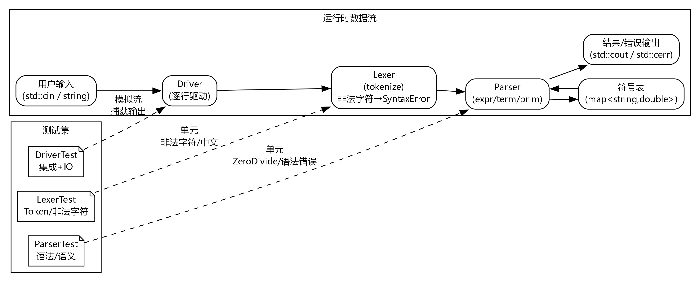

## 程序测试实验报告（SkiCalc）

### 1. 被测对象与功能概述
- 项目：SkiCalc（命令行计算器）
- 核心模块：`Lexer`（词法分析）、`Parser`（表达式解析与求值）、`Driver`（逐行读取/输出）、符号表（变量存储）。
- 语法定义：见仓库 `README.md` 中的 BNF（四则运算、括号、变量赋值与引用）。

### 2. 测试环境
- 操作系统：Windows x64（课程提供环境）
- 工具链：Visual Studio / MSVC（premake 生成 VS 解决方案）
- 单元测试框架：Google Test（已随仓库 vendor）

### 3. 测试范围与用例设计
测试按照“单元 + 组合”的分层思路：
- **LexerTest（词法单元）**
	- 数字、运算符、括号、赋值、标识符、空白处理。
	- 多 token 序列。
	- 非法字符抛出 `SyntaxError`。
	- 非 ASCII 输入（如中文 UTF-8）抛出 `SyntaxError`，避免 isspace/isalnum 对负值断言。
- **ParserTest（语法/求值单元）**
	- 基本表达式、负号、运算符优先级、括号优先级。
	- 变量赋值/覆盖/多变量引用；浮点与边界值（大数/小数/科学计数）。
	- 异常：语法错误、除零 `ZeroDivide`。
	- 复杂嵌套与错误边界（连续操作符、不完整括号、除零分支）。
- **DriverTest（集成 + IO）**
	- 多行输入、变量赋值与计算流水线。
	- 错误输出捕获（除零、语法错误）。
	- 内置常量 `pi/e` 访问与输出。
	- 空行/空白的健壮性。

### 4. 缺陷与修复要点
- **非 ASCII 输入导致 CRT 断言**：`isspace/isalnum/isalpha` 直接接收有符号 char（UTF-8 高位字节为负）触发断言。
	- 修复：统一对传入 ctype 的字符做 `static_cast<unsigned char>`，并将未知字符抛为 `SyntaxError`。
- **非法字符处理**：此前默认落入 `END`，导致错误被吞；现改为构造信息 "invalid character: X" 抛出 `SyntaxError`，由 Parser/Driver/测试统一捕获。
- **健壮性**：标识符读取失败时避免对无效流执行 `putback`。

### 5. 测试执行与结果
测试过程：
1. 运行GenerateProject.bat，使用premake生成vs文件；
2. 使用vs打开项目项目文件SkiCalc.sln，编译运行；

本轮测试结果：全部通过。
测试执行截图：

### 6. 测试结果与覆盖概览
- 词法：覆盖所有合法 token 路径 + 非法/非 ASCII 分支；多 token 序列覆盖循环逻辑。
- 语法：覆盖 expr/term/prim 主干分支，括号/优先级/赋值/异常路径均有断言；包含数值边界与精度场景。
- 集成：覆盖 `Driver` 逐行处理、变量持久化、错误输出分支、空行跳过。

#### LexerTest
- 数字与浮点（`31`、`3.14`），运算符、括号、赋值号。
- 标识符多形态：单字符、多字符含数字、下划线开头。
- 空白处理与输入结束分支；多 token 序列 `x = 3 + 4`。
- 异常分支：非法字符 `@`、非 ASCII（中文 UTF-8）均抛 `SyntaxError`。

#### ParserTest
- 基础与优先级：加减乘除、负号、括号优先级、嵌套表达式。
- 变量：赋值、覆盖、跨变量依赖、变量名边界（大小写、数字、下划线）。
- 浮点与边界：常规浮点、极小/科学计数、大数、小数、精度边界。
- 异常：语法错误（缺项/非法操作符/不完整括号）、除零与除零边界。

#### DriverTest
- 多行交互：算术流水、变量赋值与引用、复杂表达式。
- 错误输出：除零、语法错误，验证 `errorCount` 计数。
- 内置常量：`pi`、`e` 输出校验。
- 健壮性：空行/空白行忽略处理。

### 7. 结论与改进方向
- 现有测试集已覆盖核心功能、主要异常和重要边界值，并补上非 ASCII/非法字符导致的崩溃缺陷。
- 可进一步改进：
	1) 支持 UTF-8 解码后的标识符（而非简单报错），需调整 Lexer/Parser 设计；
	2) 补充性能/长输入压力测试；
	3) 在 CI 中自动运行测试并生成报告（如 JUnit XML + 覆盖率）。

### 8. 测试架构示意

